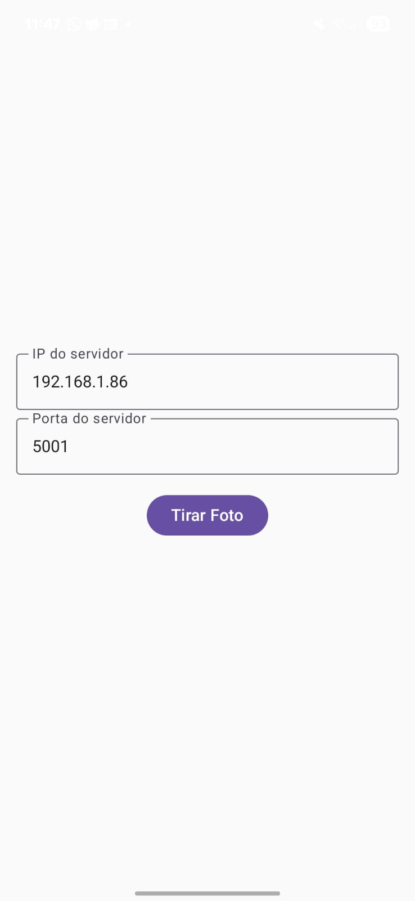
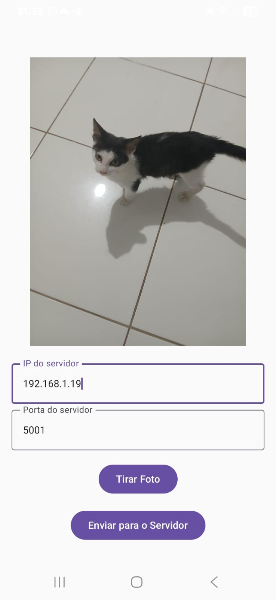
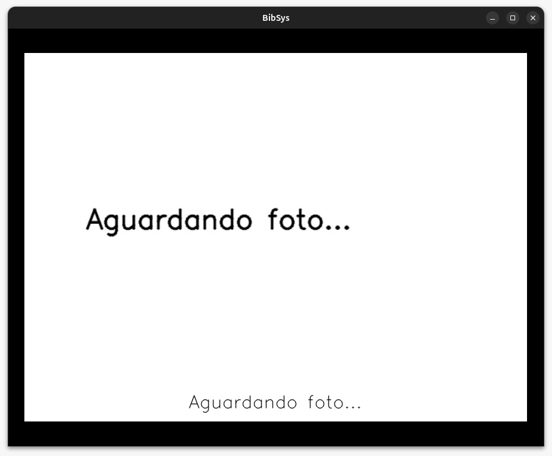
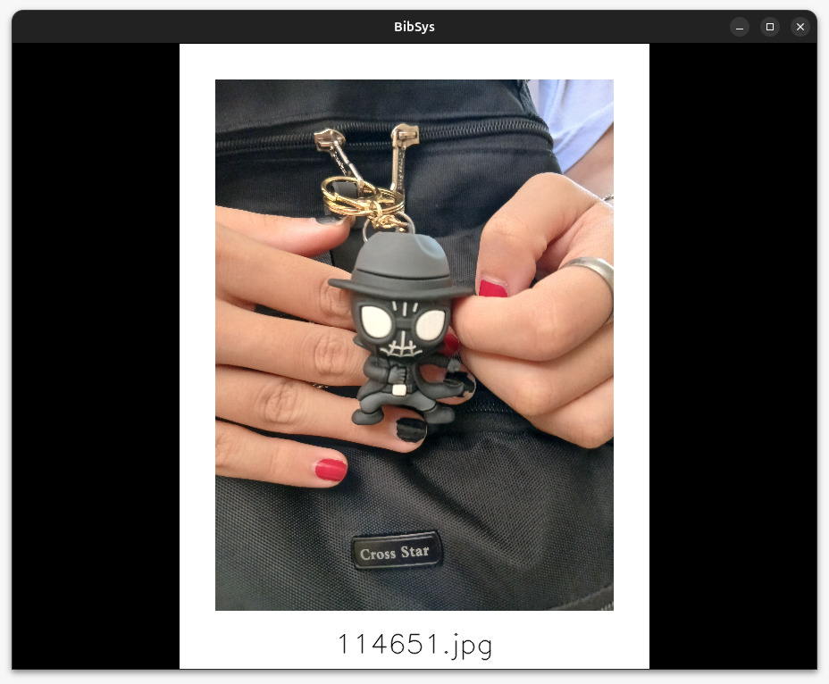

# 📌 Guia de Execução do Projeto

Este repositório contém dois módulos principais:

- **Servidor (Python)**
- **Aplicativo Android (Kotlin)**

Abaixo estão os passos para rodar cada parte do sistema.

---

## 📱 Estrutura do projeto

```bash
FOTO-ANDROID
├── 📱 app/                       # Aplicativo Android (Kotlin)
│   └── 📂 src/main/java/com/example/foto_android/
│       ├── ui/
│       │   └── MainActivity.kt   # Código principal da aplicação
│       └── res/                  # Recursos (layouts, ícones, etc)
│   └── AndroidManifest.xml
│
├── 🖥️ servidor/                  # Servidor em Python
│   ├── server.py                 # Servidor TCP que recebe imagens
│   ├── requirements.txt          # Dependências Python
│   └── 📂 data/                  # Onde as imagens recebidas são salvas
│
├── 🖼️ imagens/                   # Screenshots para README
│   ├── app.jpeg
│   └── app_foto.jpeg
│
└── 📖 README.md                  # Documentação do projeto
```

---

## 🚀 Como rodar o **Servidor (Python)**

1. Navegue até a pasta do servidor:

   ```bash
   cd servidor
   ```

2. Crie um ambiente virtual Python (recomendado):

   ```bash
   python -m venv .venv
   ```

3. Ative o ambiente virtual:

   - **Linux/macOS**:
     ```bash
     source .venv/bin/activate
     ```
   - **Windows (PowerShell)**:
     ```powershell
     .venv\Scripts\Activate.ps1
     ```

4. Instale as dependências listadas em `requirements.txt`:

   ```bash
   pip install -r requirements.txt
   ```

5. Execute o servidor:
   ```bash
   python server.py
   ```

---

## 📱 Como rodar o **Aplicativo Android (Kotlin)**

1. Navegue até a pasta do app:

   ```bash
   cd kotlin
   ```

2. Certifique-se de que o **modo desenvolvedor** e a **depuração USB** estão ativados no celular.

3. Conecte o celular via cabo USB ao notebook.

4. Execute o comando para instalar o app:

   ```bash
   ./gradlew installDebug
   ```

5. Ao final da instalação, abra o aplicativo diretamente no dispositivo Android.

---

# 🖥️ Telas

## 📱 Interface do Aplicativo

| Antes de tirar a foto    | Depois de tirar a foto             |
| ------------------------ | ---------------------------------- |
|  |  |

---

## 💻 Interface do Servidor

Servidor iniciado, aguardando a imagem ser enviada


Servidor após receber a foto

